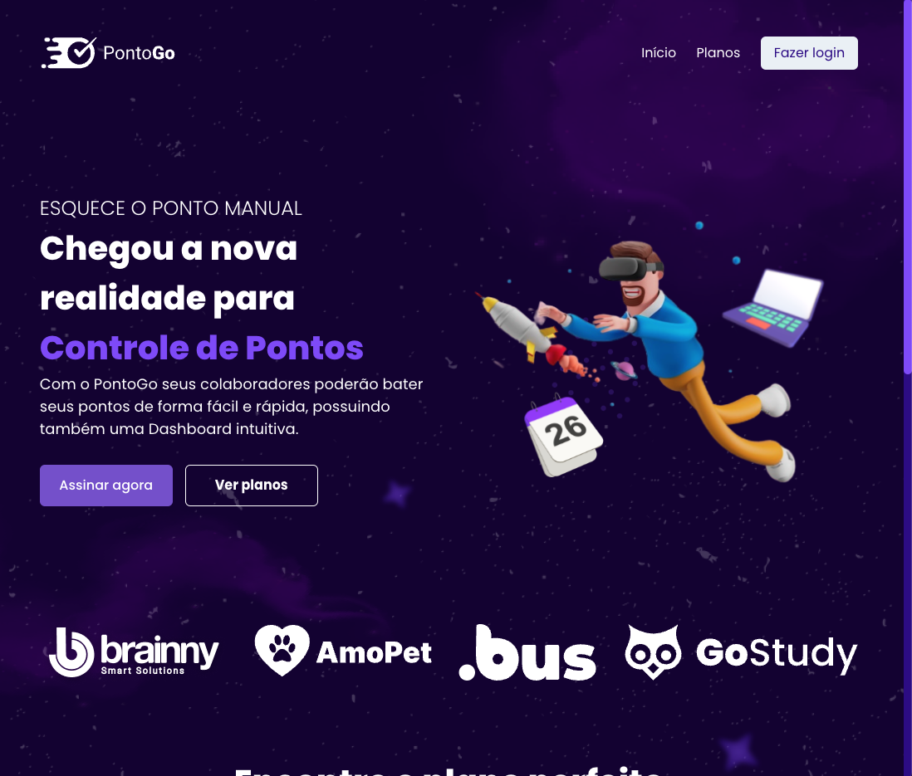
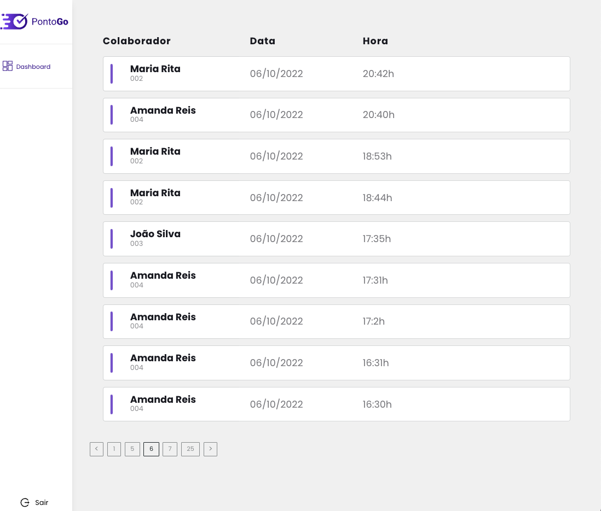

<h1 align="center">

</h1>

Project of  control point registered, with point listings for each user and a dashboard with point listings for all users.

 
 

Landing page developed for the dissemination of the system PontoGo.

 
 

 <a href="#Technologies">Technologies</a> •
 <a href="#Gallery system images">Images</a> •
 <a href="#Get-Started">Get started</a> •
 <a href="#View-Project">View Project Online</a> •
 <a href="#Developer">Developer</a>

  
 

## 🚀 Technologies

 
 

In this Project I used the following technologies, React and NextJS to develop our web interface, GraphQL to communicate with the API, below I will list some other tools used.

 
 

- ✅ Typescript
- ✅ Apollo
- ✅ Codegen
- ✅ Chakra UI
- ✅ Nookies

## Gallery system images

 
 

 
 

 
 
 

## Get started

 
 

To run the project on your local machine, just clone the repository, and run the "yarn" command in the terminal to download and install the app's dependencies

Then open in your browser the url ´https://localhost:3000´

 
 

## View Project Online

 
<h2 align="center">Link: https://teste-front-brainny.vercel.app</h3>
 
 

## 👨‍🔧 Developer

---

  

  <a href="https://www.linkedin.com/in/devjoaodias/">
 
  
 <b>João Dias</b></a> <a href="https://www.linkedin.com/in/devjoaodias/" title="João Dias">&nbsp;&nbsp;🚀</a>

Feito com ❤️ por João Dias 👋🏽 Entre em contato!

  

 
 
